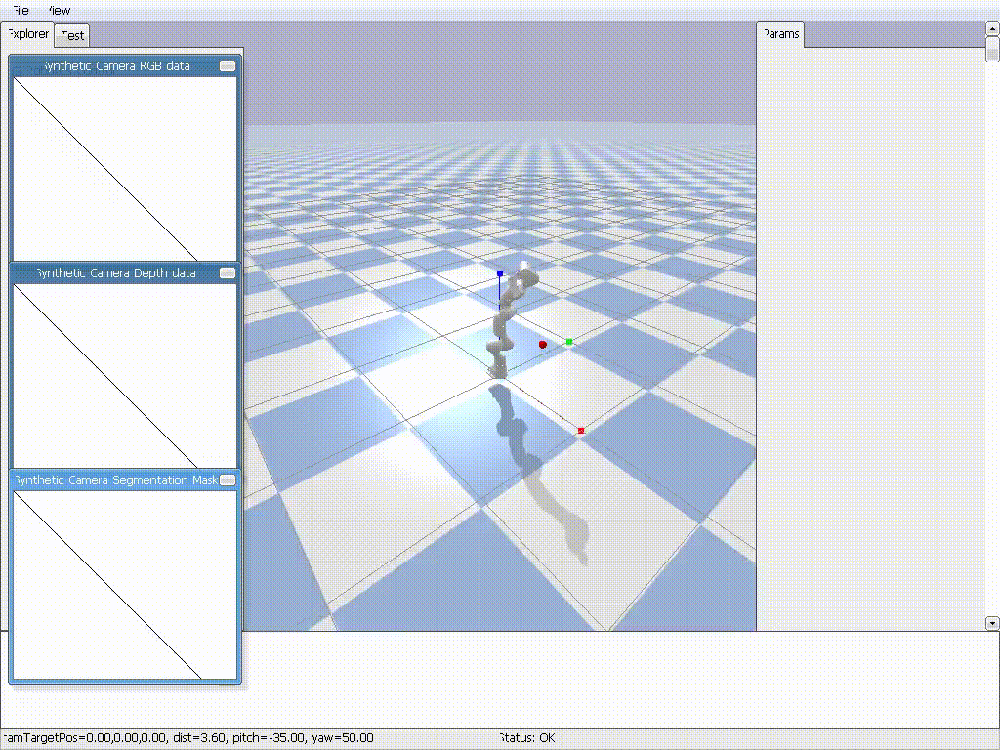

# Reinforcement Learning for Robotic Manipulation with Franka Panda

This is my personal skill development project exploring reinforcement learning for robotic manipulation. I'm training a Franka Emika Panda robot arm to perform reaching tasks in PyBullet simulation, progressing from basic state-based control to advanced vision-based policies as I build my expertise in robotics and machine learning.

The project represents my learning journey through different levels of complexity, with each stage expanding my understanding of RL, computer vision, and robotic control.


---
## Project Roadmap

This project is divided into several stages, each representing a different level of agent intelligence and perception.

### ✅ Level 1: State-Based RL (Implemented)
* **Goal:** Teach the agent to control the robot using perfect, noise-free 3D coordinate information.
* **Method:** The agent receives the 3D position of its hand and the target as input (`MlpPolicy`).
* **Purpose:** To master the fundamentals of robot control, reward shaping, and the RL training loop.
* **Files:** `franka_reach_env.py`, `train.py`, `evaluate.py`

### ✅ Level 2: Vision-Based RL (Implemented)
* **Goal:** Teach the agent to perform the same task using only "pixels-only" (RGB) data from a simulated camera.
* **Method:** The agent receives an 84x84 image as input and must learn to interpret it using a Convolutional Neural Network (`CnnPolicy`).
* **Purpose:** To solve the fundamental perception problem of inferring 3D world state from a 2D image (visual servoing).
* **Files:** `franka_reach_env_vision.py`, `train_vision.py`, `evaluate_vision.py`

### 🔜 Level 3: Advanced Perception (Future Work)
* **Goal:** Enhance the agent's perception by incorporating more sensor data.
* **Method:** The observation space would be modified to include a depth channel (RGB-D), providing the agent with an informative shortcut for understanding 3D geometry.
* **Purpose:** To explore how different sensor modalities can make robotic tasks easier and more reliable.

### 🚀 Level 4: Vision-Language-Action (VLA) Models (Future Work)
* **Goal:** Control the robot using natural language commands.
* **Method:** Integrate a large, pre-trained VLA model (e.g., from Hugging Face `lerobot`) into the environment. The model would take a camera image and a text prompt (e.g., "pick up the red block") to generate actions.
* **Purpose:** To apply state-of-the-art research models to achieve complex, language-instructed tasks.

---

## 🎥 Trained Simulation Results

Here's a high-quality demonstration of my trained agent performing the reaching task across multiple episodes:



*This ultra high-quality GIF demonstrates the Franka Panda robot successfully reaching for randomly positioned red targets in the simulation environment. The demonstration showcases episodes 1, 5, 9, 13, 17, and 20 playing sequentially, highlighting different target positions, arm trajectories, and success scenarios. The agent learned this behavior through reinforcement learning using PPO (Proximal Policy Optimization) over 5 million training steps.*

### Additional Results
For the complete set of 20 evaluation episodes, see the `tuned_results_05/` folder containing all original MP4 recordings.

---
## Setup and Installation

1.  **Clone the repository:**
    ```bash
    git clone <your-repo-url>
    cd industrial_rl_project
    ```

2.  **Create and activate a Python virtual environment:**
    ```bash
    python3 -m venv .venv
    source .venv/bin/activate
    ```

3.  **Install dependencies:**
    ```bash
    pip install -r requirements.txt
    ```

4.  **(For Video Recording)** Ensure FFmpeg is installed (for Ubuntu/WSL):
    ```bash
    sudo apt-get update && sudo apt-get install ffmpeg
    ```

---
## How to Run

Make sure your virtual environment is activated before running any scripts.

### 1. State-Based Agent (Level 1)

* **To train:** `python train.py`
* **To evaluate:** `python evaluate.py`

### 2. Vision-Based Agent (Level 2)

* **To train (requires a CUDA-enabled GPU):** `python train_vision.py`
* **To evaluate:** `python evaluate_vision.py`

---
## Evaluation Log

For a detailed breakdown of different model versions, training experiments, and performance metrics, please see the [EVALUATION.md](EVALUATION.md) file.