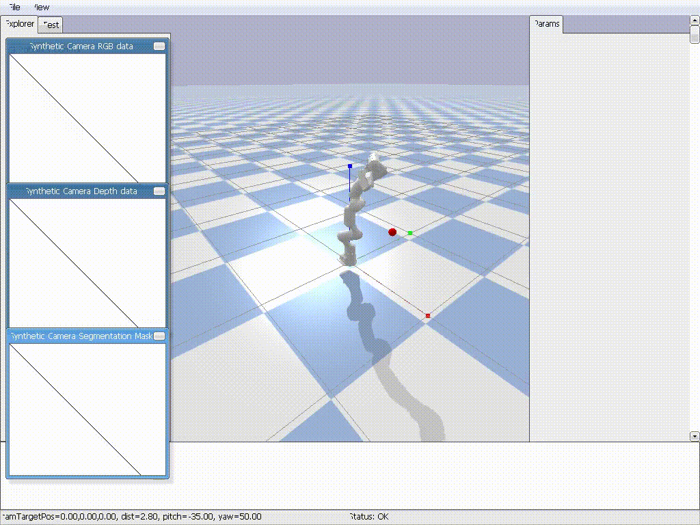

# Reinforcement Learning for Robotic Manipulation with Franka Panda

This is my personal skill development project exploring reinforcement learning for robotic manipulation. I'm training a Franka Emika Panda robot arm to perform reaching tasks in PyBullet simulation, progressing from basic state-based control to advanced vision-based policies as I build my expertise in robotics and machine learning.

The project represents my learning journey through different levels of complexity, with each stage expanding my understanding of RL, computer vision, and robotic control.

---
## Project Roadmap

This project is divided into several stages, each representing a different level of agent intelligence and perception.

### ✅ Level 1: State-Based RL (Implemented)
* **Goal:** Teach the agent to control the robot using perfect, noise-free 3D coordinate information.
* **Method:** The agent receives the 3D position of its hand and the target as input (`MlpPolicy`).
* **Simulator:** PyBullet
* **Purpose:** To master the fundamentals of robot control, reward shaping, and the RL training loop.

### ✅ Level 2: Vision-Based RL (Implemented)
* **Goal:** Teach the agent to perform the same task using only "pixels-only" (RGB) data from a simulated camera.
* **Method:** The agent receives an 84x84 image as input and must learn to interpret it using a Convolutional Neural Network (`CnnPolicy`).
* **Simulator:** PyBullet
* **Purpose:** To solve the fundamental perception problem of inferring 3D world state from a 2D image.

### 🔜 Level 3: Advanced Perception with MuJoCo (Next Step)
* **Goal:** Enhance the agent's perception by incorporating depth data (RGB-D) and transitioning to a more physically accurate simulator.
* **Method:** The observation space will be modified to include a depth channel (RGB-D). We will rebuild the environment using **MuJoCo**, a fast and accurate physics simulator popular in robotics research.
* **Purpose:** To work with multi-modal sensor data and a research-grade simulator.

### 🚀 Level 4: ROS2 Integration (Final Goal)
* **Goal:** Deploy the best-performing vision-based policy in a ROS2-enabled simulation environment.
* **Method:** The agent's policy will be wrapped in a ROS2 node. This node will subscribe to camera topics and publish control commands, interacting with a simulated robot in Gazebo or Isaac Sim.
* **Purpose:** To learn the standard Sim-to-Real workflow used by robotics companies.

---
## 🎥 Trained Simulation Results

Here's a high-quality demonstration of my trained agent performing the reaching task across multiple episodes:



*This high-quality demonstration shows the Franka Panda robot successfully reaching for randomly positioned red targets in the simulation environment. The demonstration showcases episodes 1, 5, 9, 13, 17, and 20 playing sequentially at 0.5x speed for detailed observation of the robot's learned movements, highlighting different target positions, arm trajectories, and success scenarios. The agent learned this behavior through reinforcement learning using PPO (Proximal Policy Optimization) over 5 million training steps.*

### Additional Results
For the complete set of 20 evaluation episodes, see the `tuned_results_05/` folder containing all original MP4 recordings.

---
## Setup and Installation

1.  **Clone the repository:**
    ```bash
    git clone [https://github.com/shubhamt2897/industrial_rl_project.git](https://github.com/shubhamt2897/industrial_rl_project.git)
    cd industrial_rl_project
    ```

2.  **Create and activate a Python virtual environment:**
    ```bash
    python3 -m venv .venv
    source .venv/bin/activate
    ```

3.  **Install dependencies:**
    ```bash
    pip install -r requirements.txt
    ```

4.  **(For Video Recording)** Ensure FFmpeg is installed (for Ubuntu/WSL):
    ```bash
    sudo apt-get update && sudo apt-get install ffmpeg
    ```

---
## How to Run

Make sure your virtual environment is activated before running any scripts.

### 1. State-Based Agent (Level 1)

* **To train:** `python train.py`
* **To evaluate:** `python evaluate.py`

### 2. Vision-Based Agent (Level 2)

* **To train (requires a CUDA-enabled GPU):** `python train_vision.py`
* **To evaluate:** `python evaluate_vision.py`

---
## Evaluation Log

For a detailed breakdown of different model versions, training experiments, and performance metrics, please see the [EVALUATION.md](EVALUATION.md) file.